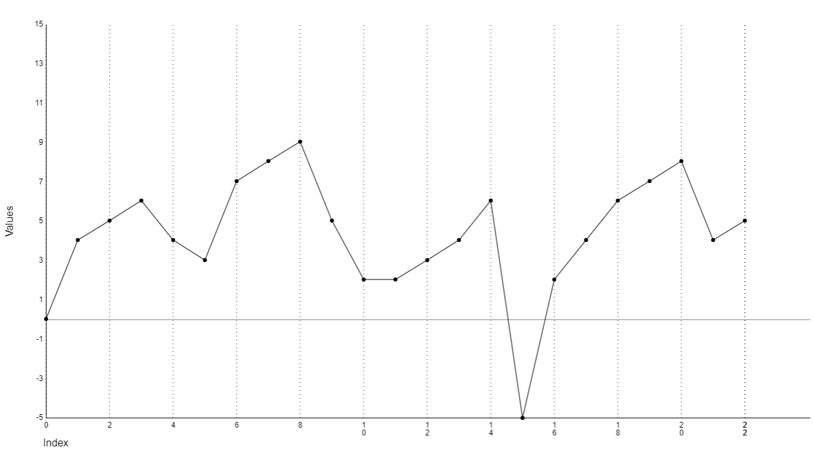

# An overview of the GraphDrawer component

This README is only intended as a quick summery, so you can decide if this component is for you.  
See the demo application for example usage,  
and the [full README.MD](./components/graphdrawer/README.MD) in the components/graphdrawer folder for documentation of the public methods.

Graphdrawer uses the canvas element to render an array of numerical data using the canvas element.  
It also does some automatic scaling of the data to fit the canvas element,  
adapt the Y-axis to the range of the data, and the X-axis to the length of the data,  
and it will render the data as a graph with a graphline and dots at the data points.  
If zero is included in the data, it will also render a zero-line.

You can also change several settings, like colors, font, size, etc.  
All this are done by calling methods on the GraphDrawer element,  
no bulky attributes,  
no css, no complicated javascript calculations, height this and width that,  
just a simple method call.

Here we see the graphdrawer element in action,  
rendering the array [0,4,5,6,4,3,7,8,9,5,2,2,3,4,6,-5,2,4,6,7,8,4,5].

## Dependencies

Uses 'validation-collection' for input validation,  
Install it with `npm install validation-collection` or `yarn add validation-collection`

The component will work in any browser that supports the following:

* Custom Elements - [https://caniuse.com/custom-elementsv1](https://caniuse.com/custom-elementsv1)
* Shadow DOM - [https://caniuse.com/shadowdomv1](https://caniuse.com/shadowdomv1)
* Canvas API - [https://caniuse.com/canvas](https://caniuse.com/canvas)

## Demo

There is a demo application available at [https://github.com/kodsmed/graphdrawer-demopage](https://github.com/kodsmed/graphdrawer-demopage)

A live demo is available at [https://graphdrawerdemo.netlify.app/](https://graphdrawerdemo.netlify.app/)

## Installation and usage

See the **[full README.MD](./components/graphdrawer/README.MD)** in the **components/graphdrawer** folder

## License

MIT License, Jimmy Karlsson 2023, [./components/graphdrawer/LICENSE](./components/graphdrawer/LICENSE)