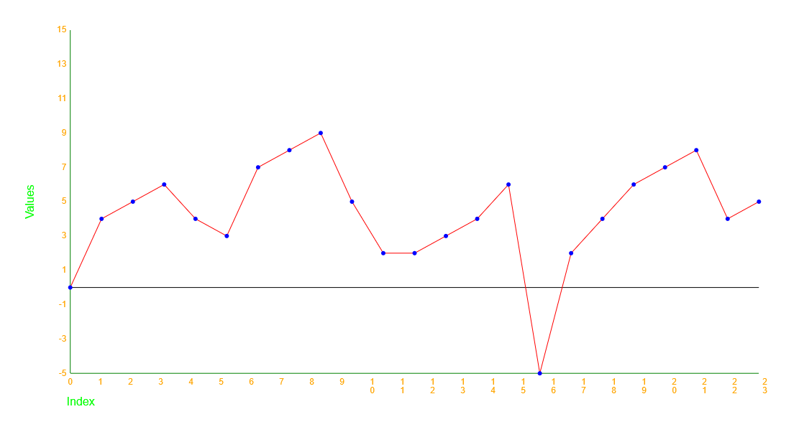

# Graphdrawer

// TODO: COPY THIS README TO THE COMPONENT FOLDER

Uses the canvas element to render an array of numerical data.

## Usage

Copy the /components/graphdrawer folder into your project and import it into your code.
An example of usage is provided in the root index.html and index.js files.
The surrounding code is just for test and demonstration purposes and not required for the graphdrawer to work,
only the graphdrawer folder is required. However, I encourage you to also include the test suite in your project.

## Testing

The test suite is written in Jest for the jsdom test environment and can be run with the command `npm run test`.
If you want to include the test suite in your project, copy the /test folder into your project and import it into your code.
If you want to change the test environment, the test suit may need to be adapted.
If you want to run the test suite in your project, make sure to include the following scripts in your package.json:

```json
"scripts": {
    "test": "npx --node-options=--experimental-vm-modules jest || exit 0",
}
```

Make sure to also include the test dependencies in your project:

* jest
* jest-environment-jsdom

## How to render?

Call the method "render(number[])" on the GraphDrawer object. The array of numbers will be rendered as a graph.
The X axis will be the index of the array, the Y axis will be the value of the array at the given index.
The graph will be scaled to fit the canvas element.
The Y-axis will be scaled according to the range of the values in the array.

The X-axis will be scaled according to the length of the array.
A maximum of 20 labels will be rendered on the X-axis
(however there is a bug in the current implementation, so if the length is a prime number, as many labels as will fit will be rendered).

## How to change the colors? Not Yet implemented

Call the method "setColors(string[graphLineColor, graphDotColor, zeroLineColor, axisColor, labelColor, titleColor])" on the GraphDrawer element.

Valid values are:

* 'red'
* 'green'
* 'lime'
* 'blue'
* 'yellow'
* 'orange'
* 'purple'
* 'black'
* 'gray'
* 'white'

example usage:

```javascript
graphDrawer.setColors(['red', 'blue', 'black', 'green', 'orange', 'lime']);
```


## How to change the size? Not Yet implemented

The size of the graph is defined by the width and height attributes on the graphdrawer element. The following attributes are available:

* width: The width of the graph, defaults to 300
* height: The height of the graph, defaults to 300

## How to change the axis? Not Yet implemented

The axis are defined by HTML attributes on the graphdrawer element. The following attributes are available:

* data-axis-x: The label of the x axis, defaults to 'x'
* data-axis-y: The label of the y axis, defaults to 'y'

## Hot to change the size of the dots? Not Yet implemented

The size of the dots is defined by the data-dot-size attribute on the graphdrawer element.

* data-dot-size: The size of the dots must be a number 0 to 10. 0 means no dots will be rendered. Defaults to 3 pixels.

## Known bugs and issues

* If the length of the array is a prime number, the X-axis will not limit the amount of labels rendered.
* There is currently no handling of an array that contains more values than the canvas element can reasonably display. This will result in a graph that is too small to be useful. On a full-size screen, you can fit about 1000 values on the X-axis.
* There is currently no setters for the options, see the above sections marked "Not Yet implemented".