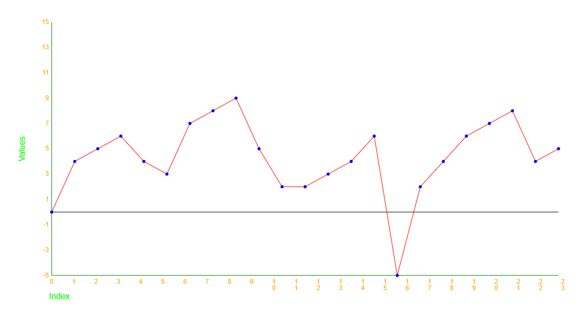

# Graphdrawer

Uses the canvas element to render an array of numerical data.

## Usage

Copy the /components/graphdrawer folder into your project and import it into your code.
An example of usage is provided in the root index.html and index.js files.
The surrounding code is just for test and demonstration purposes and not required for the graphdrawer to work,
only the graphdrawer folder is required. However, I encourage you to also include the test suite in your project.

## Testing

The test suite is written in Jest for the jsdom test environment and can be run straight out of the repo with the command `npm run test`.
If you want to change the test environment, the test suit may need to be adapted.

If you want to run the test suite in your project, make sure to include the following scripts in your package.json:

```json
"scripts": {
    "test": "npx --node-options=--experimental-vm-modules jest || exit 0",
}
```

Make sure to also include the test dependencies in your project:

* jest
* jest-environment-jsdom

```json
  "devDependencies": {
    "jest": "^29.7.0",
    "jest-environment-jsdom": "^29.7.0"
  },
```

Install the dependencies with `npm install` and run the test suite with `npm run test`.

## How to render?

Call the method "renderArrayAsGraph(number[])" on the GraphDrawer object. The array of numbers will be rendered as a graph.
The X axis will be the index of the array, the Y axis will be the value of the array at the given index.
The graph will be scaled to fit the canvas element.
The Y-axis will be scaled according to the range of the values in the array.

The X-axis will be scaled according to the length of the array.
A maximum of 20 labels will be rendered on the X-axis
(however there is a bug in the current implementation, so if the length is a prime number, as many labels as will fit will be rendered).

example usage:

```javascript
const graphDrawer = document.querySelector('jk224jv-graphdrawer');
graphDrawer.render([1, 2, 3, 4, 5, 6, 7, 8, 9, 10]);
```

see the projects root-folder index.html and index.js files for a more complete example.

## How to change the colors? Not Yet implemented

Call the method "setColors(string[{graphLineColor: 'color'}, {graphDotColor: 'color'}, {zeroLineColor: 'color'}, {axisColor: 'color'}, {labelColor: 'color'}, {titleColor: 'color'}])" on the GraphDrawer element.
Objects not included in the array will be ignored, so you can set only the colors you want to change.
Default values are: 'black' for everything except the zeroLineColor that is 'gray'.

Valid values are:

* 'red'
* 'green'
* 'lime'
* 'blue'
* 'yellow'
* 'orange'
* 'purple'
* 'black'
* 'gray'
* 'white'

example usage:

```javascript
const graphDrawer = document.querySelector('jk224jv-graphdrawer');
graphDrawer.setColors([{ graphLineColor: 'red' }, { graphDotColor: 'blue' }, { zeroLineColor: 'black' }, { axisColor: 'green' }, { labelColor: 'orange' }, { titleColor: 'lime' }]);
```



## How to change the size? Not Yet implemented

Call the method "setSize({width: number}, {height: number})" on the GraphDrawer element.
Objects not included in the object will be ignored, so you can set only the size you want to change.

example usage:

```javascript
const graphDrawer = document.querySelector('jk224jv-graphdrawer');
graphDrawer.setSize({ width: 500 }, { height: 500 });
```

## How to change the axistitles? Not Yet implemented

Call the method "setAxisTitles({xAxis: 'string'}, {yAxis: 'string'})" on the GraphDrawer element.
Objects not included in the object will be ignored, so you can set only the size you want to change.
Default values are "Value" for the Y-axis and "Index" for the X-axis.

example usage:

```javascript
const graphDrawer = document.querySelector('jk224jv-graphdrawer');
graphDrawer.setAxis({ xAxis: 'Time' }, { yAxis: 'Value' });
```

## Hot to change the size of the dots? Not Yet implemented

Call the method "setDataPointDotsSize(number)" on the GraphDrawer element.
The size of the dots must be a number 0 to 10. 0 means no dots will be rendered. Defaults to 3 pixels.

example usage:

```javascript
const graphDrawer = document.querySelector('jk224jv-graphdrawer');
graphDrawer.setDataPointDotsSize(5);
```

## How to clear the canvas? Not Yet implemented

Call the method "clear()" on the GraphDrawer element.

example usage:

```javascript
const graphDrawer = document.querySelector('jk224jv-graphdrawer');
graphDrawer.clear();
```

## Known bugs and issues

* If the length of the array is a prime number, the X-axis will not limit the amount of labels rendered.
* There is currently no handling of an array that contains more values than the canvas element can reasonably display. This will result in a graph that is too small to be useful. On a full-size screen, you can fit about 1000 values on the X-axis.
* There is currently no setters for the options, see the above sections marked "Not Yet implemented".